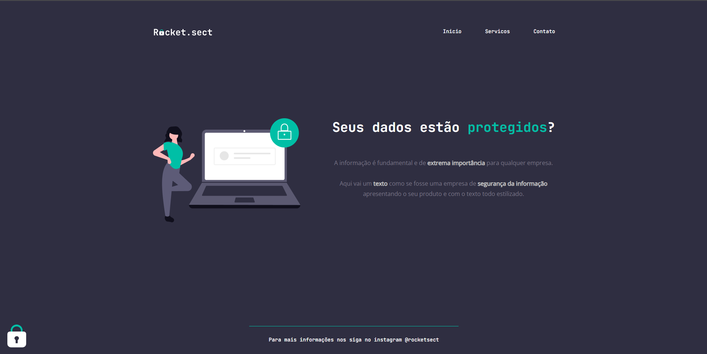

<h1 align="center"> Desafio Intermediário - Recriando layout </h1>

 

  

## 🖥️ Tecnologias

Esse projeto foi desenvolvido com as seguintes tecnologias:

- HTML 
- CSS
- Git e Github

## 📂 Projeto

  Projeto foi recriado uma aplicação a partir de um layout pronto no figma, para fortalecer alguns conceitos aprendidos em aula na Rocketseat, entre eles:

      <li>Estruturando um projeto HTML</li>
      <li>Uso de tags HTML mais comuns</li>
      <li>Conceitos iniciais de CSS</li>
      <li>Posicionamento e alinhamento de elementos na tela</li>
      <li>Aplicando fontes customizadas</li>
      <li>Espaçamentos.</li>
  </ul>

 

## 🔖 Layout

Você pode visualizar o layout do projeto através [DESSE LINK](https://www.figma.com/file/ugnO4mQpXQ2fdmC38XIPuL/Explorer-(Copy)?node-id=0%3A1&t=rnFHpaUUlDZZ5Yw0-0). É necessário ter conta no [Figma](https://figma.com) para acessá-lo. 

  

## 📧 Contato

E-mail: victorvbprogramador@gmail.com

Linkedin: https://www.linkedin.com/in/victor-vinicius-9b0765263/

